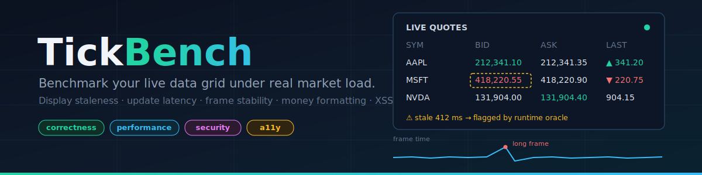

# TickBench

[](https://github.com/RomanFedytskyi/TickBench/actions/workflows/ci.yml)
[](https://www.npmjs.com/package/tick-bench-cli)
[](https://www.npmjs.com/package/tick-bench-cli)
[](https://bundlephobia.com/package/tick-bench-cli)
[](https://www.npmjs.com/package/tick-bench-cli)
[](https://www.npmjs.com/package/tick-bench-cli)
[](#benchmark-your-own-component)
[](LICENSE)
[](docs/task-authoring.md)
<!-- After the first GitHub Release is archived by Zenodo, add:
[](https://doi.org/10.5281/zenodo.XXXXXXXX) -->
[](https://github.com/RomanFedytskyi/TickBench)

> **Never ship a grid that paints a stale price.**

TickBench replays **seeded, replayable market-data tick streams** against your data-grid or
dashboard component in headless Chromium and tells you what your users would actually see:
**display staleness**, update latency percentiles, dropped frames, lost updates, broken money
formatting, live XSS sinks, and WCAG violations — one command, one JSON report, one
pass/fail verdict.

<p align="center">
  
</p>

## What is this?

**TickBench is like Lighthouse, but for live data tables.** Lighthouse loads your page and
grades it. TickBench goes further for one specific, high-stakes kind of UI — tables that
display fast-changing numbers (prices, positions, risk, metrics) — and grades what a user
would actually see while thousands of updates per second are flowing in.

Your unit tests check logic. Your visual tests check pixels at rest. **Nothing you run today
checks whether the number on screen right now is the number that arrived 400 ms ago** — or
whether your table silently drops updates, stutters, mis-formats money, executes a malicious
string, or loses its accessible structure under load. TickBench checks exactly that, in a
real (headless) Chrome, and gives you a PASS/FAIL verdict per implementation.

**Use it when you:**

- build any dashboard with live numbers — trading, crypto, risk, fleet, analytics, admin;
- are choosing a table/grid library and don't want to trust vendor marketing benchmarks;
- let AI coding tools write frontend code and need an objective gate before merging it;
- want a CI check proving a refactor didn't make the table slower or wrong.

## How it works (60 seconds)

**Step 1 — you write one small file** (an adapter). Important: your app never imports
TickBench, and `applyTick` is not imported from anywhere — **you define it, and TickBench
calls it**. TickBench imports *your* file, calls your `createGrid` once to mount the table,
then calls your `applyTick` ~17,000 times with simulated market updates while filming the
result frame by frame.

```js
// my-adapter.mjs — the whole contract
export function createGrid(container, symbols, cols) {
  // mount YOUR table into `container` (any framework; relative imports work)
  // each rendered cell needs data-sym / data-col attributes so TickBench can watch it
  return {
    applyTick(tick) {
      // TickBench calls this with { sym, col, v } for every update.
      // Route it into your table the same way your app would (setState, setCell, ...).
    }
  };
}
```

**Step 2 — run it** from your project folder:

```bash
npx tick-bench-cli bench --impl ./my-adapter.mjs --name my-table
```

**Step 3 — read the verdict.** Three outputs every run: the console table, a browser-ready
**HTML report** (`./tickbench-results/report-stream-grid.html`), and JSON for CI:

<p align="center">
  
</p>

Complete runnable example with a real component file: [`examples/walkthrough/`](examples/walkthrough/).
Framework recipes (React, AG Grid): [`docs/connect-your-table.md`](docs/connect-your-table.md).


## How do you test a real-time data grid?

If you searched for *how to test a real-time data grid*, *measure display staleness*, *React
table streaming updates benchmark*, *virtualized grid dropped updates*, *validate AI-generated
frontend code*, or *my dashboard shows stale prices under load* — this is the tool for that.

## Why this exists

Every trading, risk, lending, and analytics UI is a grid fed by a stream. Under burst load,
implementations fail in ways no existing tool measures:

- the DOM shows a **price that is no longer true** (staleness),
- the **latest** update is silently never painted (lost update),
- the main thread stalls for hundreds of ms (frame stability),
- `1234567.5` cents becomes `12345.68` instead of `12,345.68` (money formatting),
- an interpolated symbol name becomes an **XSS payload**,
- the grid loses its accessible structure (WCAG).

Grid vendors publish marketing benchmarks; js-framework-benchmark tests static rows. TickBench
tests **your implementation, under your workload, against executable acceptance criteria** —
including code written by AI coding agents before you let it near production.

## Quick start (this repository)

```bash
git clone https://github.com/RomanFedytskyi/TickBench.git && cd TickBench
npm ci
npx playwright-core install chromium-headless-shell   # one-time browser download

npm test           # unit tests
npm run validate   # oracle validation: reference passes, mutants are caught
npm run bench      # score all bundled submissions for tasks/stream-grid
```

```
                                     reference  claude-fable-5  naive-baseline
catch-up latency p50 (ms)                 24.3            24.1             8.1
catch-up latency p95 (ms)                 31.8            32.1            37.3
stale cell-frames (%)                    17.41           17.44               0
long frames >33ms (%)                        0             0.2            2.49
worst frame (ms)                          16.8            49.9           516.7
final format errors                          0               0             157
XSS triggered (dynamic)                  false           false            true
security findings (high)                     0               0               1
axe violations                               0               0               1
REGULATED-GRADE PASS                      true            true           false
```
Three submissions ship with the repo: a human **reference**, a genuine single-shot
**AI-generated submission** (`claude-fable-5`, provenance documented, unedited model output),
and a hand-written **naive-baseline** used to validate the oracles. Note the trade-off the
numbers expose: the unbatched baseline paints *faster at the median* but stalls for half a
second at the worst — while rAF-batched implementations trade a single frame of staleness
for stability. That frontier is invisible until you measure it.

## What gets measured

Formal definitions live in [`docs/metrics.md`](docs/metrics.md):

| Dimension | Oracle | Metrics |
|---|---|---|
| Update correctness | runtime, frame-sampled | display staleness, catch-up latency p50/p95/p99, lost updates |
| Rendering performance | runtime | long-frame rate, worst frame |
| Money display | final-state sweep | value errors, locale/format errors |
| Security | static sink scan + dynamic canary | injection findings, XSS execution |
| Accessibility | axe-core | WCAG 2.1 A/AA violations |

Thresholds are part of each task's `oracle.config.json` — acceptance criteria are versioned
data, not harness code. Every gate is validated: the shipped `naive-baseline` submission is a
deliberately broken implementation that `tickbench validate` proves each oracle catches.

## Real workloads

Synthetic traces are seeded and deterministic (`tickbench gen --seed …`). You can also record
real feeds (e.g., public exchange WebSocket streams, or your own production feed) into the
same schema — set `"synthetic": false` and ship a provenance file. See
[`docs/task-authoring.md`](docs/task-authoring.md).

## CLI

```
tick-bench-cli bench --impl ./my-adapter.mjs [--name LABEL]   benchmark YOUR component (any directory)
tick-bench-cli bench [--task DIR] [--submission NAME]         benchmark a task's reference + submissions
tick-bench-cli gen [--seed N] [--duration MS] [--symbols N] [--out FILE]
tick-bench-cli validate [--task DIR]
tick-bench-cli new-submission <name> [--task DIR]             scaffold a submission for model output
```

Common options: `--trace FILE` (custom workload), `--out DIR` (default `./tickbench-results`),
`--no-reference` (skip the built-in comparison baseline).

## Contributing

New tasks, new metrics, and submissions of real-world grid implementations are all welcome —
see [CONTRIBUTING.md](CONTRIBUTING.md). Metrics need a definition **and** a validation mutant.

## Citation

If TickBench is useful in your work, cite it via [`CITATION.cff`](CITATION.cff).

## License

Code: MIT © 2026 Roman Fedytskyi. Bundled and recorded trace data (`traces/`): CC BY 4.0.
