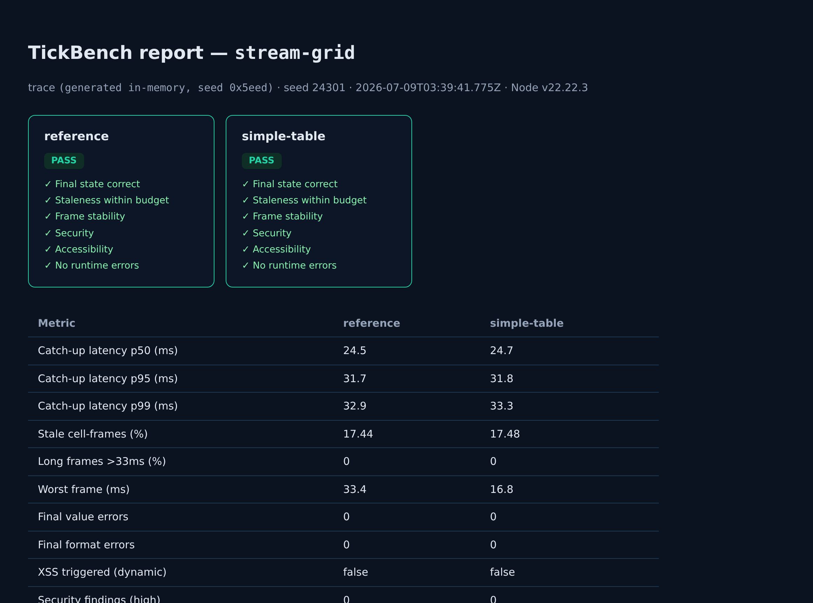

# Walkthrough: benchmark a simple table, end to end

This folder is a complete, runnable example. It contains an ordinary table component
(pretend it's yours) and the one adapter file that connects it to TickBench.

```
walkthrough/
  my-table.mjs   <- "your" existing component: SimpleTable with mount()/setCell()
  adapter.mjs    <- the ONLY file you write: imports my-table.mjs, implements the contract
  README.md      <- you are here
```

## Step 0 — install (once)

```bash
npm install tick-bench-cli playwright-core axe-core
npx playwright-core install chromium-headless-shell
```

## Step 1 — your component

`my-table.mjs` is a plain class with its own API — it knows nothing about TickBench:

```js
const table = new SimpleTable({ rows, columns, title: 'Live prices' });
table.mount(el);
table.setCell('AAPL', 'bid', '12,345.67');
```

## Step 2 — the adapter (the only thing you write)

One thing people often ask: **where does `applyTick` come from?** Nowhere — you don't
import it. You *write* it inside the object your `createGrid` returns, and TickBench calls
it (about 17,000 times) to deliver price updates to your table. Direction of control:
TickBench imports your file and calls your functions, never the other way round.

`adapter.mjs` does three things — mount, tag, route:

```js
import { SimpleTable } from './my-table.mjs';        // relative imports work

export function createGrid(container, symbols, cols) {
  const table = new SimpleTable({ rows: symbols, columns: cols });  // 1. mount
  table.mount(container);

  for (const sym of symbols) for (const col of cols) {              // 2. tag cells
    const td = table.getCell(sym, col);                             //    so the oracle
    td.dataset.sym = sym; td.dataset.col = col;                     //    can watch them
  }

  return { applyTick(tick) { /* 3. route ticks into table.setCell(...) */ } };
}
```

(Full version with money formatting and rAF batching is in the file.)

## Step 3 — run

```bash
npx tick-bench-cli bench --impl ./adapter.mjs --name simple-table
```

## Step 4 — what you get

Actual output of this exact example:

```
                                     reference    simple-table
catch-up latency p50 (ms)                 24.5            24.5
catch-up latency p95 (ms)                 31.6            31.6
stale cell-frames (%)                     17.7           17.48
long frames >33ms (%)                      0.2               0
worst frame (ms)                           150            33.4
final value errors                           0               0
final format errors                          0               0
XSS triggered (dynamic)                  false           false
security findings (high)                     0               0
axe violations                               0               0
REGULATED-GRADE PASS                      true            true

Results:
  console : table above
  html    : ./tickbench-results/report-stream-grid.html   <- open this in a browser
  json    : ./tickbench-results/report-stream-grid.json
```

Open the HTML file: one card per submission (green PASS / red FAIL with a per-gate
checklist) and the full metric table. The JSON has every number for CI or charts.

A committed copy of this exact run is in [`sample-results/`](sample-results/) — open
[`sample-results/report-stream-grid.html`](sample-results/report-stream-grid.html) in a
browser right now, before running anything, to see what you'll get. Screenshot:

<p align="center">
  
</p>

How to read the key rows:

- **catch-up latency p95 = 31.6 ms** — when a price arrives, the correct value is on
  screen within ~2 frames at the 95th percentile.
- **stale cell-frames ≈ 17%** — the cost of rAF batching (about one frame of staleness);
  within the 20% budget, and it buys the perfect frame stability on the next row.
- **final errors = 0** — after the burst, every cell shows exactly the right,
  correctly-formatted amount.
- **XSS / axe = clean** — the trace injected a malicious symbol name and it never
  executed; the table kept caption/scope/headers.

## Step 5 — see it fail (optional, 30 seconds)

In `adapter.mjs`, replace `table.setCell(...)` with
`table.getCell(t.sym, t.col).innerHTML = ...` and rerun. The static scan flags the
innerHTML sink; if you also interpolate the symbol into that HTML, the dynamic XSS canary
fires and the verdict flips to FAIL. That's the tool doing its job.
